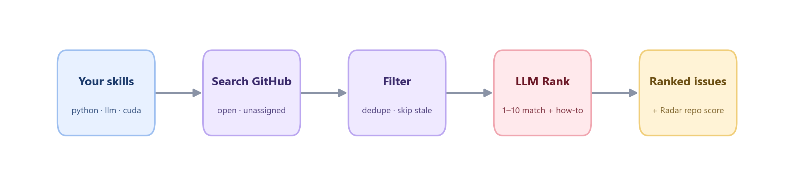

<div align="center">


Tell it your skills → it searches GitHub for open issues you can fix → ranks them by match → scores repos by maintainer responsiveness and PR merge patterns.

[](https://pypi.org/project/gitsense-radar/)
[](LICENSE)
[](https://www.python.org/downloads/)
[](https://github.com/he-yufeng/GitSense/actions)

**[English](README.md) · [中文](README_CN.md)** &nbsp;·&nbsp; [Quick Start](#quick-start) · [Demo](#demo) · [How It Works](#how-it-works)

</div>

---

## The Problem

You want to contribute to open source, but finding the right issue is painful. You scroll through hundreds of issues on GitHub, most of which are either claimed, too vague, out of your skill range, or just not worth the effort. By the time you find something decent, you've burned an hour on browsing alone.

**GitSense** does the searching for you. It queries GitHub for open, unassigned issues across thousands of repos, then uses an LLM to rank them by how well they match YOUR specific skills and tell you exactly how to get started.

The new Radar mode answers the next question: is this repo actually worth your PR? It checks public PR history, stale backlog, open-to-merged PR pressure, outsider merge ratio, and maintainer response time before you invest a weekend in a repo that might ignore good work.

## Quick Start

```bash
pip install gitsense-radar
```

```bash
# Find open issues that match your skills, ranked by an LLM
gitsense find --skills python,llm,cuda

# Scan one repo, or score repos before you invest a weekend
gitsense scan vllm-project/vllm --skills python,cuda
gitsense radar vllm-project/vllm microsoft/qlib --skills python,llm --out radar.md
```

## Demo

```bash
$ gitsense find --skills python,llm,cuda --stars 1000
```

```
Found 24 candidates.
Ranking with gpt-4o-mini...

╭──────────── GitSense Results ────────────╮
│ Skills: python, llm, cuda                │
│ Results: 8 issues ranked by match        │
╰──────────────────────────────────────────╯

  1. [9/10] vllm-project/vllm
     Fix CUDA graph memory leak in speculative decoding
     https://github.com/vllm-project/vllm/issues/36200
     Labels: bug, good first issue
     Perfect match — requires CUDA + Python + LLM inference knowledge.
     How to start: Look at vllm/spec_decode/worker.py, the graph
     capture context isn't releasing GPU memory on exception paths.

  2. [8/10] triton-lang/triton
     Type inference fails for constexpr in nested loops
     https://github.com/triton-lang/triton/issues/9650
     Labels: bug
     Strong match — Python compiler internals, related to GPU kernels.
     How to start: Check code_generator.py visit_For, similar to #9547.

  3. [7/10] huggingface/transformers
     ...
```

## How It Works



1. **Search** — Builds targeted GitHub search queries from your skills (e.g. `python is:issue is:open no:assignee stars:>=100`). Searches across all of GitHub, not just repos you follow.

2. **Filter** — Deduplicates results, skips archived / already-assigned / stale issues by default, and can drop noisy threads with too many comments.

3. **Rank** — Sends the candidates to an LLM along with your skill profile. The LLM scores each issue 1-10 on match quality and provides:
   - Why it's a good match (or not)
   - A concrete hint on how to approach the fix

4. **Display** — Renders ranked results in a clean terminal UI with Rich.

5. **Radar** — Scores target repos from public PR signals: recent merged PRs, open/stale PR backlog, open-to-merged pressure, median merge time, maintainer response time, outside contributor merge ratio, risk flags, and skill fit.

## Usage

```bash
# Find issues across GitHub, ranked by skill match
gitsense find --skills python,fastapi --stars 5000 --labels bug
gitsense find --skills python --no-llm                              # skip LLM ranking (faster)
gitsense find --skills python --watch                             # digest of what's new since your last watch
gitsense find --skills python --model anthropic/claude-sonnet-4 --limit 15
gitsense find --skills python,llm --format json --out results.json  # export like radar/triage

# Or let GitSense read your public repos and infer your skills for you
gitsense profile torvalds
gitsense find --profile torvalds

# Scan one repo's open, unassigned issues
gitsense scan pytorch/pytorch --skills python --updated-days 14

# Score repos before investing a weekend (Markdown or JSON evidence)
gitsense radar vllm-project/vllm microsoft/qlib --skills python,llm --out radar.md
gitsense radar --targets targets.txt --skills python,agents --format json --out radar.json

# Predict whether a specific open PR will merge (0–100 from public signals)
gitsense predict vllm-project/vllm#12345

# Triage every open PR you've authored, worst-first (one next action each)
gitsense triage octocat
gitsense triage octocat --shallow            # one search call, no per-PR lookups
gitsense triage octocat --since-last         # only what changed since your last run
```

`radar` weighs recent merge velocity, maintainer response time, stale-PR ratio, open-to-merged pressure, and outsider-friendliness; `predict` scores one PR from its review decision, draft/conflict/CI status, diff size, tests, and age. `triage` reuses the same scoring across all your open PRs and collapses each into a next action (address the review, fix CI, rebase, ping), fetching the per-PR signals in one batched GraphQL query instead of four REST calls per PR, with an automatic REST fallback. All are triage heuristics, not guarantees.

## Configuration

### GitHub Token (recommended)

Without a token you get 10 requests/minute. With a token, 30/minute:

```bash
export GITHUB_TOKEN=your-github-token
```

If GITHUB_TOKEN is not set, GitSense falls back to `gh auth token`, so a logged-in GitHub CLI works with no manual token setup.

### State Files

Watch history (`find --watch`) and triage snapshots (`triage --since-last`) live in `~/.gitsense`, so they survive running gitsense from any directory. Pass `--state-dir` to keep them elsewhere. An old `.gitsense` folder in the current directory is copied over once, not deleted.

### LLM Provider

GitSense uses an OpenAI-compatible API for ranking. Without an API key, it still works — you just don't get skill-match scoring.

```bash
# OpenAI
export OPENAI_API_KEY=your-openai-key

# OpenRouter (100+ models)
export OPENROUTER_API_KEY=your-openrouter-key

# Local (Ollama)
export OPENAI_BASE_URL=http://localhost:11434/v1
export OPENAI_API_KEY=ollama
```

## FAQ

**Does this replace looking at issues manually?**
No. GitSense is a first-pass filter that saves you the time of scrolling through hundreds of issues. You should still read the issue thread and understand the codebase before committing to a contribution.

**How accurate is the LLM ranking?**
The LLM is good at matching keywords and assessing complexity from issue descriptions. It can't tell you whether the maintainers will actually merge your PR or how the codebase is structured. Think of it as a smart sort, not an oracle.

**Does this cost money?**
GitHub search is free (rate-limited without a token). LLM ranking costs whatever your provider charges per call — typically $0.001-0.01 per search with gpt-4o-mini. Use `--no-llm` to skip ranking entirely.

## Roadmap

**Shipped:** watch mode (`find --watch` digests only the issues you have not seen, per filter set), repo radar (gauge maintainer responsiveness and merge-friendliness before you invest time), PR success prediction (estimate merge probability for a specific draft), profile mode (infer your skills from your public repos, so the issue search seeds itself), and PR triage (one next action for every open PR you've authored, worst-first).

**Planned:**

- **Difficulty calibration** — check the radar's difficulty estimate against issues you actually closed, so the score gets more honest the more you use it.

## Contributing

Contributions welcome. If GitSense helped you find your first open source contribution, that's the best feedback possible.

## Related Projects

If GitSense pointed you at open source worth doing, here are a few more of my projects:

- **[CoreCoder](https://github.com/he-yufeng/CoreCoder)** — want to understand how a coding agent really works? Read the whole ~1k-line engine end to end, not a black box.
- **[RepoWiki](https://github.com/he-yufeng/RepoWiki)** — dropped into an unfamiliar codebase? It gives you a guided wiki and a where-to-start reading path, a self-hostable DeepWiki alternative.
- **[FindJobs-Agent](https://github.com/he-yufeng/FindJobs-Agent)** — stop sifting job boards by hand: it ranks postings against your resume and runs mock interviews.
- **[ContractGuard](https://github.com/he-yufeng/ContractGuard)** — catch the risky clauses before you sign: it reads contracts and flags the dangerous bits.
- **[CodeABC](https://github.com/he-yufeng/CodeABC)** — understand any codebase even if you don't code, built for non-programmers.

## License

[MIT](LICENSE)
